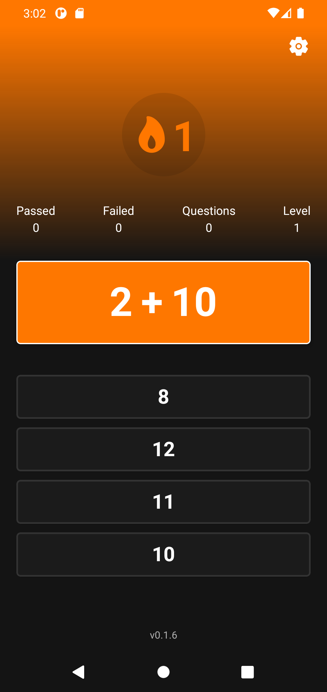
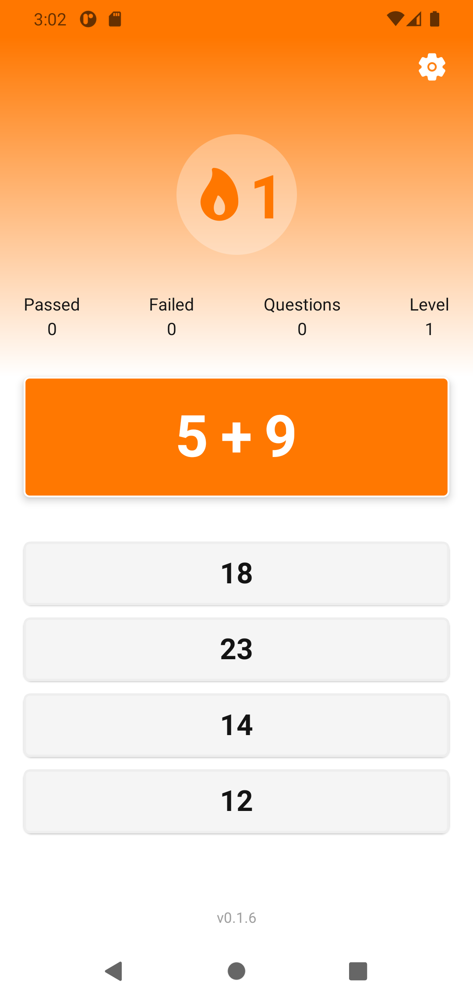
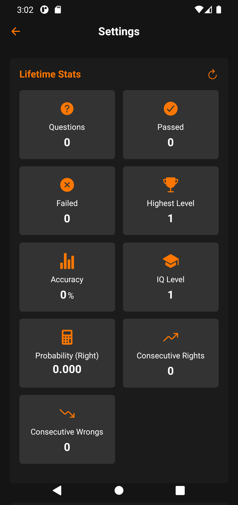
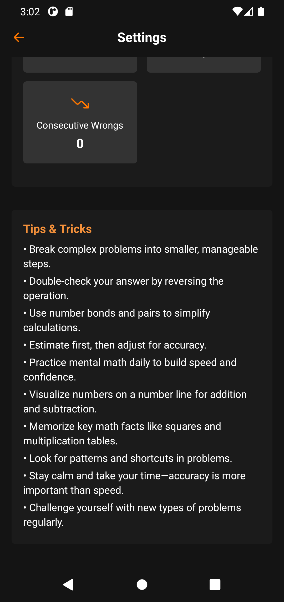

# Math Leveling App

A modern, gamified mental math training application built with React Native and Expo. Practice arithmetic, track your progress, and maintain daily streaks—all with a beautiful, responsive interface and robust offline support.

---

## Features

### 🧮 Math Training

- **Dynamic Question Generation:** Practice addition and subtraction with randomly generated questions.
- **Multiple Choice:** Answer via a quick-tap grid for fast-paced learning.
- **Difficulty Progression:** Level up as you answer correctly; questions get harder as you improve.

### 🎮 Gamification & Analytics

- **Streak System:** Maintain daily streaks with reminders and notifications.
- **Statistics:** Track total questions, correct/incorrect answers, highest level, and more.
- **Strict Mode:** Optional mode for increased challenge.
- **Lifetime Stats:** Persistent analytics for long-term progress.

### 🌙 Theming & UX

- **Light/Dark Theme:** Automatic system detection and manual override.
- **Smooth Transitions:** Seamless theme switching and UI updates.
- **Responsive Design:** Optimized for all device sizes and orientations.

### ⚡ Performance & Offline

- **MMKV Storage:** Fast, secure local storage for stats, streaks, and settings.
- **Offline-First:** All core features work without an internet connection.

### 🔔 Notifications

- **Streak Reminders:** Daily push notifications to help you keep your streak alive.

### 🛠️ Settings & Customization

- **Operator Selection:** Choose which arithmetic operations to practice.
- **Reset Stats:** Clear your progress and start fresh.
- **Theme Toggle:** Instantly switch between light and dark modes.

---

## Screenshots

| Home Screen                                           | Streak Badge                                            | Settings Screen                                           | Extra                                                  |
| ----------------------------------------------------- | ------------------------------------------------------- | --------------------------------------------------------- | ------------------------------------------------------ |
|  |  |  |  |

---

## Tech Stack

### Frontend

- **React Native** (0.79.2) + **Expo** (53.0.9)
- **TypeScript** for type safety
- **Zustand** for state management
- **MMKV** for fast local storage
- **Expo Notifications** for reminders
- **React Native Safe Area Context** for device compatibility

### Backend

- **Node.js** + **Express**
- **MongoDB** for versioning and feedback
- **CORS** for secure API access
- **dotenv** for environment configuration
- **Scheduled Health Checks** with `node-cron`

---

## Project Structure

```
mental_math_training_app/
  src/
    components/      # UI components (HomeScreen, StreakBadge, etc.)
    context/         # Theme context and provider
    screens/         # Main app screens (Home, Settings, RootLayout)
    services/        # Version and update services
    store/           # Zustand slices for state, stats, streaks
    styles/          # Style constants
    utils/           # Utility functions
  backend/
    src/
      models/        # Mongoose models (AppVersion, Feedback)
      routes/        # API endpoints (version, feedback)
      index.js       # Express app entry point
  assets/
    images/          # App images
    screenshots/     # App screenshots
```

---

## Getting Started

### Prerequisites

- Node.js
- Bun (recommended) or npm
- Android Studio (for Android)
- Xcode & CocoaPods (for iOS, macOS only)
- MongoDB (for backend)

### Installation

1. **Clone the repository:**

   ```bash
   git clone <repository-url>
   cd mental_math_training_app
   ```

2. **Install frontend dependencies:**

   ```bash
   bun install
   ```

3. **Install backend dependencies:**

   ```bash
   cd backend
   npm install
   cd ..
   ```

4. **Set up environment variables:**

   - Create a `.env.local` file in the root and add:
     ```
     EXPO_PUBLIC_RATES_API_URL=your_api_url_if_needed
     ```

5. **Start the development servers:**

   ```bash
   # Terminal 1 - Frontend
   bunx expo start

   # Terminal 2 - Backend
   cd backend && npm run dev
   ```

---

## Available Scripts

### Frontend

- `bun run start` — Start Expo development server
- `bun run android` — Run on Android device/emulator
- `bun run ios` — Run on iOS simulator
- `bun run build:android` — Build Android preview
- `bun run build:web` — Build web version
- `bun run publish:expo` — Publish OTA updates
- `bun run test` — Run tests
- `bun run format` — Format code
- `bun run lint` — Lint code

### Backend

- `npm start` — Start production server
- `npm run dev` — Start development server with hot reload

---

## API Endpoints

### Versioning

- `GET /api/version/latest` — Get the latest app version (optionally filter by major version)
- `POST /api/version/` — Create or update a version (for CI/CD)
- `DELETE /api/version/:version` — Delete a version

### Feedback

- `POST /api/feedback/` — Submit user feedback
- `GET /api/feedback/` — Retrieve all feedback (admin)

### Health

- `GET /health` — Health check endpoint

---

## Environment Configuration

- **Development:** Debug features enabled
- **Production:** Optimized for release
- **Preview:** For pre-release and OTA updates

---

## License

[MIT License](LICENSE)

---

_This README was generated based on the current codebase structure and features. For more details, see the source code and comments throughout the project._
